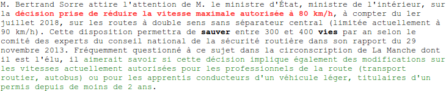
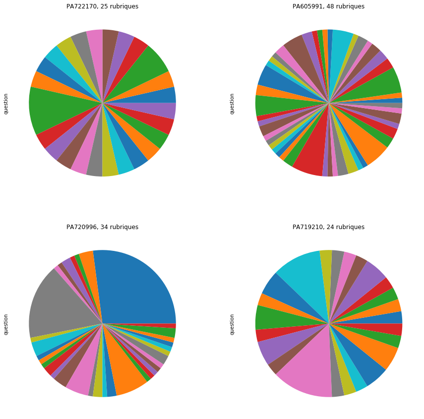

# Point 22/06
## 1. Observations sur les données
### 1.1 Structure des lettres

[observation_lettres](../jupyter/observation_lettres.ipynb)
### 1.2 Lettres parlant d'un même sujet
[observation_lettres](../jupyter/observation_lettres.ipynb)
### 1.3 Répartition des députés
<!--  -->
[deputes_specializes](../jupyter/deputes_specializes.ipynb)
## 2. Préciser les grandes lignes
[résumé](../README.md)
## 3. Premiers tests
## 4. Documentation
